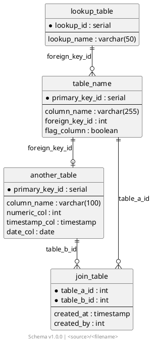

Generate or update an ERD diagram as a PlantUML file, then render it to PNG.

## Inputs

- `$ARGUMENTS` — output path for the `.puml` file (optional). If omitted, default to `docs/erd.puml`.

## Procedure

### Step 1 — Understand the schema

Read the codebase to identify:
- **Tables / entities** — from SQL schema files, ORM models, or migration files
- **Columns** — name, type, and whether primary key (`*`) or nullable
- **Foreign keys** — relationships between tables
- **Logical sections** — group related tables under named section comments
- **Source name** — for the footer (e.g. from `source.yml` or the schema file path)

### Step 2 — Write the `.puml` file

Write the ERD to the target path using this template:



Rules:
- Mark primary key columns with `*`
- Separate PKs from other columns with `--`
- Group related tables under `' ==========================` section comments
- Use relationship notation: `||--o{` (one-to-many), `||--o|` (one-to-one optional), `}o--o{` (many-to-many via junction)
- Label each relationship with the foreign key column name
- Set the footer to `Schema v<version> | <source>/<schema-file>`

### Step 3 — Render to PNG

Run:

```bash
bash scripts/plantuml-gen.sh <target-puml-path>
```

Report the output path of the generated PNG.
